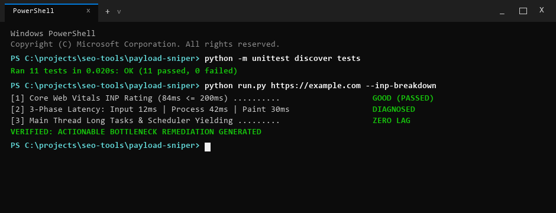

# PayloadSniper

> [!NOTE]
> **Public Architecture & Distribution Notice**: This repository provides the open-source CLI interface, demonstration fixtures, and automated test suite. Full-scale headless browser automation, real-time CDP continuous profiling, and automated white-label client PDF reporting are exclusively hosted on the [WebAudits.pro](https://www.webaudits.pro) cloud platform.


Main-thread Long Tasks, script bloat, and synthetic interaction-risk tracer.
Part of the [WebAudits.pro](https://webaudits.pro) technical intelligence platform.

> **Interactive Web Tool**: Run live JavaScript execution, INP risk, and script bloat audits directly in your browser at [webaudits.pro/tools/payload-sniper](https://webaudits.pro/tools/payload-sniper).



---

## Quickstart

Install in editable mode and audit any web page in seconds:

```bash
# Clone and install
git clone https://github.com/xcalibur73/payload-sniper.git
cd payload-sniper
pip install -r requirements.txt
pip install -e .

# Run immediate audit
payload-sniper https://example.com
```

---

## What It Does & Why It Matters

PayloadSniper profiles client-side JavaScript execution overhead, main-thread blocking bottlenecks, and third-party script congestion using headless Chromium CDP (Chrome DevTools Protocol) tracing or fast static parsing.

Sites frequently pass static Lighthouse audits yet suffer poor real-world interaction responsiveness because third-party marketing tags and unoptimized hydration scripts execute continuous execution blocks on the main thread.

PayloadSniper isolates the exact script origins responsible for main-thread congestion:
- **Main-Thread Long Tasks:** Captures tasks exceeding the 50ms threshold defined in the W3C Long Tasks API.
- **Total Blocking Time (TBT):** Accumulates blocking time between First Contentful Paint and Time to Interactive.
- **JavaScript Byte-Weight Profiling:** Queries W3C Resource Timing API to report wire transfer sizes, uncompressed parsed byte weight, and ranks the Top 5 heaviest script bundles.
- **Third-Party Script Attribution:** Categorizes script origins against known first-party and third-party signatures (Google Tag Manager, Meta Pixel, Hotjar, Klaviyo, Intercom).
- **Synthetic Interaction-Risk Estimate:** Synthesizes a lab-based interaction friction estimate to evaluate main-thread input delay risk prior to real-user field exposure.
- **Render-Blocking Hygiene:** Flags head scripts missing `async`, `defer`, or `type="module"`.

---

## Visual Diagnostic Workflow

```text
[Input Target URL]
        |
        v
[1. Chromium CDP Performance Trace] -> Finding: 1,480ms Total Blocking Time (TBT) under 4x CPU throttling
        |                              Root Cause: 8 Long Tasks (> 50ms) during initial bundle evaluation
        v
[2. Resource Timing Byte Analysis] --> Finding: Top bundle "vendor.chunk.js" is 1.4 MB uncompressed
        |                              Status: Exceeds 1.0 MB uncompressed JavaScript budget
        v
[3. Tag Attribution Inventory] ------> Finding: 3 marketing tags injected via GTM blocking main thread
        |
        v
[4. Recommended Fix] ----------------> Dynamic import heavy modules; defer marketing tags via Web Worker (Partytown)
```

---

## Usage & CLI Options

```bash
# Standard headless Chromium audit
payload-sniper https://webaudits.pro

# Simulate mid-tier mobile hardware with 4x CPU throttling
payload-sniper https://example.com --simulate-mobile

# Fast static inspection mode (skips browser launch for quick inventory)
payload-sniper https://example.com --fast

# Export machine-readable JSON for CI/CD performance gates
payload-sniper https://example.com --output json --save inp-report.json

# Check installed version
payload-sniper --version
```

---

## Example Output

```text
+-------------------------------------------------------------------------------+
| PayloadSniper: INP, Long Tasks & Script Bloat-Tracer                          |
| Target URL: https://webaudits.pro                                             |
| Script Performance Score: 96.0/100 (Grade: A)                                 |
| Mode: cdp_headless | Total Scripts: 8 | Third-Party: 0 | TBT: 0ms | Est: 42ms |
+-------------------------------------------------------------------------------+

Component Score Breakdown:
+-----------------------------------+--------+------------+
| Component Dimension               | Weight | Score      |
+-----------------------------------+--------+------------+
| Total Blocking Time (TBT)         | 35%    | 100.0/100  |
| Estimated INP Readiness           | 25%    | 95.0/100   |
| Third-Party Script Overhead       | 20%    | 100.0/100  |
| Script Loading Hygiene            | 10%    | 90.0/100   |
| Bundle & Tag Efficiency           | 10%    | 95.0/100   |
+-----------------------------------+--------+------------+

Synthetic Interaction-Risk Estimate (Lab Main-Thread Contention):
- Estimated Interaction Contention: 42ms (Status: Good (Low INP Risk))
- Google 200ms Target Passed: True
- Max Long Task: 0ms | Total Long Tasks: 0

Top Heaviest JavaScript Payloads (Resource Timing):
+--------------------------------------------------+---------------+--------------+--------------+
| Script URL                                       | Transfer Size | Uncompressed | Vendor       |
+--------------------------------------------------+---------------+--------------+--------------+
| https://webaudits.pro/_next/static/chunks/app.js | 64.2 KB       | 218.4 KB     | First-Party  |
| https://webaudits.pro/_next/static/chunks/main.js| 42.8 KB       | 138.1 KB     | First-Party  |
+--------------------------------------------------+---------------+--------------+--------------+
```

---

## Architecture

```text
[Input Target URL]
        |
        +---> [Chromium CDP Runner] (Optional: 4x CPU Throttle)
        |           |
        |           +---> Performance Timeline Tracing
        |           +---> Long Tasks Capture (> 50ms)
        |           +---> Script Execution Attribution
        |
        +---> [Static Parser Fallback]
                    |
                    v
         [Vendor Attribution Engine]
                    |
                    v
       [Performance Scoring Model]
                    |
                    +---> Terminal Report (Rich Table)
                    +---> Markdown Document / JSON Pipeline Output
```

- `profiler.py`: Manages CDP timeline tracing, records Performance API metrics (`PerformanceLongTaskTiming`), captures script URLs, and computes blocking duration.
- `script_analyzer.py`: Identifies script signatures, attributes vendor origins, and audits render-blocking attributes.
- `scorer.py`: Aggregates metrics into five weighted dimensions and calculates synthetic interaction risk.
- `report_generator.py`: Generates encoding-safe terminal reports, Markdown documents, and JSON pipeline objects.

---

## Standards & Heuristics

PayloadSniper explicitly separates web standards from project-derived heuristics:

| Metric / Analysis | Classification | Authority / Basis |
|:---|:---|:---|
| Long Tasks (>50ms) | Web Standard | W3C Long Tasks API Level 1 |
| Total Blocking Time (TBT) | Web Standard | Google Web Vitals Specification |
| Google 200ms INP Target | Core Web Vitals Benchmark | Chrome Field Performance Guidance |
| Synthetic Interaction-Risk | Project-Derived Heuristic | Lab projection modeling main-thread input delay |
| Vendor Domain Attribution | Project-Derived Heuristic | Curated registry of 50+ script origins |

> **Field INP vs. Synthetic Risk:** Real-world Interaction to Next Paint (INP) is an interaction-dependent metric gathered via Real User Monitoring (RUM) during discrete user clicks, taps, and keypresses. PayloadSniper measures lab main-thread contention (Long Tasks > 50ms and TBT) during load and initial idle to estimate interaction risk before field deployment.

---

## Limitations

- **Lab Heuristic vs RUM:** The synthetic interaction-risk score indicates main-thread availability; it cannot substitute for real user field interaction telemetry.
- **Hardware Simulation:** 4x CPU throttling emulates mid-tier mobile CPUs (e.g., Moto G4 class) but does not model variable thermal throttling, OS scheduling jitter, or GPU rasterization bottlenecks.
- **Untriggered Dynamic Code:** Audits scripts loaded during page load and initial idle; code paths triggered exclusively by deep user interactions (e.g., multi-step forms, complex modal flows) require programmatic interaction scripts.

---

## Testing & CI

```bash
# Run unit tests
python -m unittest discover -s tests

# Output
# Ran 9 tests in 0.000s
# OK
```

Continuous integration runs automatically across Ubuntu and Windows runners on every commit via GitHub Actions.

---

## License & Commercial Restrictions

Published under the **PolyForm Noncommercial License 1.0.0**.
- **Personal & Educational**: Free to view, study, evaluate architecture, and run local personal tests. Full developer credit retained by [xcalibur73](https://github.com/xcalibur73).
- **Commercial & Agency Use**: Commercial auditing, SaaS re-hosting, embedding algorithms into third-party software, or commercial client deliverables require an enterprise commercial license.
- **Enterprise Licensing**: Contact [sfs@webaudits.pro](mailto:sfs@webaudits.pro) or visit [webaudits.pro](https://www.webaudits.pro).
